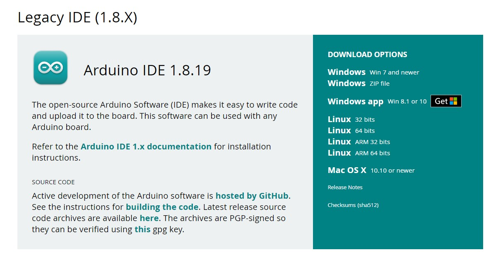

# Belajar ESP32

Repositori ini merupakan langkah untuk mendokumentasikan kegiatan praktikum embedded system menggunakan ESP32. Untuk semua kegiatan yang akan dilakukan, silakan request jika ingin menambah atau mengubah konten. Sharing is caring... :D

## Daftar Isi

1. [Pinout ESP32](#1-pinout-esp32)
2. [Penggunaan Pertama ESP32](#2-penggunaan-pertama-esp32)
   * [Download Arduino IDE Legacy](#21-download-arduino-ide-legacy)
   * [Tes Upload Kode Pertama](#22-tes-upload-kode-pertama)
   * [Tes Upload SPIFFS](#23-tes-upload-spiffs)
3. [Membuat Access Point WiFi](#3-membuat-access-point-wifi)
   * [Setup ESP32 sebagai WiFi AP](#31-setup-esp32-sebagai-wifi-ap)
   * [Setup Static IP sesuai kelompok](#32-setup-static-ip-sesuai-kelompok)
4. [Membuat Webserver sebagai akses GUI berbasis web](#4-membuat-webserver-sebagai-akses-gui-berbasis-web)
   * [Setup WebServer](#41-setup-webserver)
   * [Tes GUI untuk mengontrol LED](#42-tes-gui-untuk-mengontrol-led)
   * [Ujicoba handleRoot()](#43-ujicoba-handleroot)

---

## 1. Pinout ESP32

Bagian ini menjelaskan pinout dari ESP32. ESP32 memiliki beberapa pin GPIO, power, serta pin khusus seperti ADC, DAC, dan lainnya. Pastikan memahami fungsi setiap pin sebelum menggunakannya.

### Referensi Pinout ESP32:
- GPIO: General Purpose Input/Output
- ADC: Analog to Digital Converter (Pin GPIO 34-39)
- DAC: Digital to Analog nverter (PiP
Inline-style: 
)/esphome.io/devices/esp32.html)

---

## 2. Penggunaan Pertama ESP32

### 2.1 Download Arduino IDE Legacy

Langkah pertama adalah mengunduh Arduino IDE versi terbaru atau versi Legacy yang kompatibel dengan ESP32. Download Arduino IDE [di sini](https://www.arduino.cc/en/software).

### 2.2 Tes Upload Kode Pertama

Dalam bagian ini, kita akan mencoba mengunggah kode pertama ke ESP32. Kode sederhana ini akan menyalakan dan mematikan LED internal.

```cpp
// Mengakses LED internal (biasanya GPIO 2)
int ledPin = 2;

void setup() {
  pinMode(ledPin, OUTPUT);
}

void loop() {
  digitalWrite(ledPin, HIGH);  // Nyalakan LED
  delay(1000);                 // Tunggu 1 detik
  digitalWrite(ledPin, LOW);   // Matikan LED
  delay(1000);                 // Tunggu 1 detik
}


## Pinout ESP32


## Penggunaan Pertama ESP32

Kita akan melakukan pemrograman ESP32 menggunakan Arduino IDE versi 1.8.x daripada Arduino IDE versi 2.3.x atau yang terbaru. Ada beberapa fitur dari Arduino versi lama yang belum ada pada versi terbaru. Jadi silahkan [download Arduino IDE 1.8.x](https://www.arduino.cc/en/software "Download Arduino IDE 1.8.x ya") pada link berikut ya... 




```python

```


```python

```
