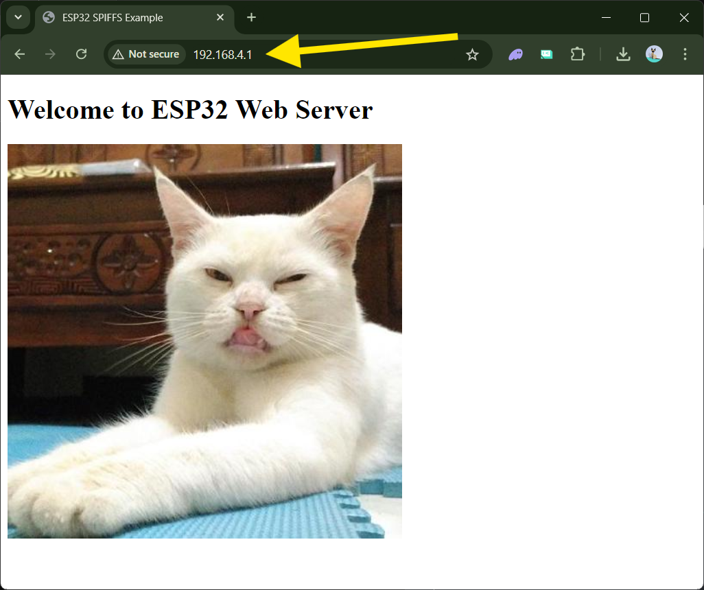

# Belajar ESP32

Repositori ini merupakan langkah untuk mendokumentasikan kegiatan praktikum embedded system menggunakan ESP32. Untuk semua kegiatan yang akan dilakukan, silakan request jika ingin menambah atau mengubah konten. Sharing is caring... :D

## Daftar Isi

1. [Pinout ESP32](#1-pinout-esp32)
2. [Penggunaan Pertama ESP32](#2-penggunaan-pertama-esp32)
   * [Download Arduino IDE Legacy](#21-download-arduino-ide-legacy)
   * [Tes Upload Kode Pertama](#22-tes-upload-kode-pertama)
   * [Tes Upload SPIFFS](#23-tes-upload-spiffs)
3. [Membuat Access Point WiFi](#3-membuat-access-point-wifi)
   * [Setup ESP32 sebagai WiFi AP](#31-setup-esp32-sebagai-wifi-ap)
   * [Setup Static IP sesuai kelompok](#32-setup-static-ip-sesuai-kelompok)
4. [Membuat Webserver sebagai akses GUI berbasis web](#4-membuat-webserver-sebagai-akses-gui-berbasis-web)
   * [Setup WebServer](#41-setup-webserver)
   * [Tes GUI untuk mengontrol LED](#42-tes-gui-untuk-mengontrol-led)
   * [Ujicoba handleRoot()](#43-ujicoba-handleroot)

---

## 1. Pinout ESP32

Bagian ini menjelaskan pinout dari ESP32. ESP32 memiliki beberapa pin GPIO, power, serta pin khusus seperti ADC, DAC, dan lainnya. Pastikan memahami fungsi setiap pin sebelum menggunakannya.

### Referensi Pinout ESP32:
- GPIO: General Purpose Input/Output
- ADC: Analog to Digital Converter (Pin GPIO 34-39)
- DAC: Digital to Analog nverter


---

## 2. Penggunaan Pertama ESP32


### 2.1 Download Arduino IDE Legacy

Kita akan melakukan pemrograman ESP32 menggunakan Arduino IDE versi 1.8.x daripada Arduino IDE versi 2.3.x atau yang terbaru. Ada beberapa fitur dari Arduino versi lama yang belum ada pada versi terbaru. Jadi silahkan [download Arduino IDE 1.8.x](https://www.arduino.cc/en/software) pada link berikut ya... 


Untuk driver silahkan mengikut tutorial pada [link berikut ini](https://samueladesola.medium.com/how-to-set-up-esp32-wroom-32-b2100060470c)

- Masuk ke board manager pada `tool >> Board >> Board Manager`


- Cari `ESP32` dan install dari `Expressif System`


### 2.2 Tes Upload Kode Pertama

Pada saat Arduino IDE dibuka untuk pertama kali, tampilan default akan muncul seperti gambar berikut ini:


- Setelah itu, mari setel Arduino IDE kita dengan board ESP32 kita. Pada kasus ini kita menggunakan varian ESP32-WROOM DA Module.


- Lalu setel `Port` ESP32 kita menjadi PORT USB yang kita gunakan. Pada OS WIndows, biasanya bernilai address `COMxx`. Pada tutorial ini menggunakan `COM4`. Pada OS Linux biasanya diawali `/dev/tty/xxx`. 


- Setelah board dan port disetel, mari kita upload kode default dari Arduino IDE dengan menekan tombol Upload di pojok kanan atas, atau tekan `CTRL + U` pada Keyboard. 


> jika sudah berhasil coba upload kode dibawah ini sebagai contoh lainnya untuk memastikan `LED INTERNAL` berfungi dengan baik.


```cpp
// Mengakses LED internal (biasanya GPIO 2)
int ledPin = 2;

void setup() {
  pinMode(ledPin, OUTPUT);
}

void loop() {
  digitalWrite(ledPin, HIGH);  // Nyalakan LED
  delay(1000);                 // Tunggu 1 detik
  digitalWrite(ledPin, LOW);   // Matikan LED
  delay(1000);                 // Tunggu 1 detik
}

```

Kode ini berfungsi untuk mengontrol LED internal pada board ESP32, yang biasanya terhubung ke pin `GPIO 2`. Pada awal program, pin `GPIO 2` diatur sebagai `OUTPUT` melalui fungsi `pinMode()`, yang memungkinkan ESP32 mengendalikan LED secara langsung. Fungsi `setup()` hanya dijalankan sekali saat board ESP32 dimulai atau di-reset, memastikan bahwa konfigurasi pin siap digunakan. Setelah itu, fungsi `loop()` akan berjalan terus menerus selama board ESP32 beroperasi, menyalakan dan mematikan LED dengan jeda waktu yang diatur oleh fungsi `delay()`.

Dalam fungsi `loop()`, LED akan dinyalakan dengan memberikan sinyal `HIGH` ke pin `GPIO 2`, yang menyebabkan LED menyala. Setelah 1 detik, fungsi `delay()` menunda eksekusi untuk menjaga LED tetap menyala selama periode ini. Setelahnya, LED dimatikan dengan memberikan sinyal `LOW` ke pin `GPIO 2`, lalu program kembali menunggu selama 1 detik. Siklus ini terus berulang, sehingga LED akan berkedip dengan pola 1 detik menyala dan 1 detik mati, menciptakan efek berkedip secara kontinu.


## 2.3 SPIFFS

## SPIFFS pada ESP32

ESP32 memiliki Serial Peripheral Interface Flash File System (SPIFFS). SPIFFS adalah sistem file ringan yang dirancang untuk mikrokontroler dengan chip flash yang terhubung melalui bus SPI, seperti memori flash ESP32. SPIFFS memungkinkan Anda mengakses memori flash seperti halnya pada sistem file biasa di komputer, tetapi lebih sederhana dan terbatas. Anda dapat membaca, menulis, menutup, dan menghapus file. Saat ini, SPIFFS tidak mendukung sistem direktori, sehingga semuanya disimpan dalam folder `/data`.

Menggunakan SPIFFS pada ESP32 berguna untuk:
* Membuat file konfigurasi dengan pengaturan sendiri,
* Menyimpan data secara permanen,
* Membuat file untuk menyimpan sejumlah kecil data daripada menggunakan kartu microSD,
* Menyimpan file HTML dan CSS untuk membangun server web,
* Menyimpan gambar (.jpg, .png, dll), grafik, file .csv, ikon (.ico), dan masih banyak lagi.

### 2.3.1 Tutorial Mengunggah File JPG dan HTML ke SPIFFS pada ESP32

Tutorial ini menjelaskan cara mengunggah file **JPG** dan **HTML** ke **SPIFFS** menggunakan Arduino IDE dengan plugin **ESP32 Sketch Data Upload**. Dengan SPIFFS, Anda dapat menyimpan file dan mengaksesnya dari program di ESP32.

### Langkah 1: Instalasi Plugin **ESP32 Sketch Data Upload**

1. **Download Plugin:**
   - Unduh plugin **ESP32 Sketch Data Upload** dari [repositori GitHub ini](https://github.com/me-no-dev/arduino-esp32fs-plugin).
   - Pilih versi yang sesuai dengan sistem operasi Anda (Windows, Mac, atau Linux).

> berikut download plugin SPIFFS 


2. **Ekstrak dan Install Plugin:**
   - Ekstrak file ZIP.
   - Copy folder hasil ekstrak ke dalam direktori Arduino IDE:
     - **Windows**: `C:\Users\<NamaUser>\Documents\Arduino\tools\ESP32FS\tool\ESP32FS.jar`
     - **Mac/Linux**: Letakkan folder di dalam folder Arduino (di lokasi yang sama seperti pada Windows).

> berikut lokasi instalasi plugin Arduino IDE 


3. **Restart Arduino IDE:**
   - Setelah plugin ditempatkan di folder yang benar, tutup Arduino IDE dan buka kembali.

   > berikut tampilan plugin **ESP32 Sketch Data Upload** saat sudah terinstal dengan benar. 


### Langkah 2: Membuat Folder Data dan Menambahkan File JPG dan HTML

1. **Membuat Folder `data`:**
   - Buka Arduino IDE.
   - Buat sketch baru atau buka sketch yang sudah ada.
   - Di dalam folder proyek sketch Anda (biasanya di `C:\Users\<NamaUser>\Documents\Arduino\<NamaSketch>`), buat folder baru bernama `data`.

> Membuat folder data pada sketch folder. 

2. **Menambahkan File JPG dan HTML:**
   - Tempatkan file-file yang ingin diunggah (misalnya, `image.jpg` dan `index.html`) ke dalam folder `data`.

3. **Contoh Isi File `index.html`:**
   - Buat file HTML sederhana bernama `index.html` dengan isi berikut:
   ```html
   <!DOCTYPE html>
   <html>
   <head>
     <title>ESP32 SPIFFS Example</title>
   </head>
   <body>
     <h1>Welcome to ESP32 Web Server</h1>
     
   </body>
   </html>
   ```
   - Pastikan juga file gambar `image.jpg` ada di folder data.


> Menambahkan file `image.jpg` dan `index.html` pada folder data. 


### Langkah 3: Mengunggah File ke SPIFFS

1. Pastikan setting board **ESP32-WROOM** (sesuai yang digunakan) dan **Upload Speed** diatur ke `115200` dan port ESP32 sudah dipilih.
2. Klik **Tools** dan Anda akan melihat opsi baru bernama **ESP32 Sketch Data Upload**.
3. Pilih opsi ini dan tunggu hingga proses pengunggahan selesai. Semua file di dalam folder `data` akan diunggah ke SPIFFS ESP32.

> Tanda SPIFFS sudah terunggah dengan sempurna. 

### Langkah 4: Akses File dari SPIFFS di dalam Kode Arduino

Setelah file diunggah, Anda bisa mengaksesnya dari program ESP32. Berikut adalah contoh kode yang menggunakan SPIFFS untuk menyajikan file HTML dan JPG melalui server web:


```cpp
#include "SPIFFS.h"
#include <WiFi.h>
#include <WebServer.h>

const char* ssid = "Kelompok_1";
const char* password = "12345678";

WebServer server(80);

void handleRoot() {
  File file = SPIFFS.open("/index.html", "r");
  if (!file) {
    server.send(404, "text/plain", "File not found");
    return;
  }
  server.streamFile(file, "text/html");
  file.close();
}

void handleImage() {
  File file = SPIFFS.open("/image.jpg", "r");
  if (!file) {
    server.send(404, "text/plain", "File not found");
    return;
  }
  server.streamFile(file, "image/jpeg");
  file.close();
}

void setup() {
  Serial.begin(115200);

  // Start SPIFFS
  if (!SPIFFS.begin(true)) {
    Serial.println("An error has occurred while mounting SPIFFS");
    return;
  }
  
  // Start WiFi
  WiFi.softAP(ssid, password);
  Serial.println("Access Point Started");

  // Configure routes
  server.on("/", handleRoot);
  server.on("/image.jpg", handleImage);

  server.begin();
  Serial.println("HTTP server started");
}

void loop() {
  server.handleClient();
}

```


- **SPIFFS.begin(true)**: Inisialisasi SPIFFS. Ini mempersiapkan sistem file SPIFFS agar bisa digunakan untuk menyimpan dan membaca file.

- **server.on("/", handleRoot)**: Saat seseorang mengakses halaman utama (`/`), file `index.html` akan dikirim ke browser. Fungsi `handleRoot` bertanggung jawab untuk mengirimkan file HTML ini.

- **server.on("/image.jpg", handleImage)**: File gambar `image.jpg` akan disajikan saat diakses melalui URL `/image.jpg`. Fungsi `handleImage` bertanggung jawab untuk mengirimkan file gambar ini.

### Langkah 5: Uji Koneksi

1. Setelah program diunggah ke ESP32, sambungkan perangkat (misalnya, laptop atau smartphone) ke WiFi dengan nama **Kelompok_1** dan password **12345678**.

> Sambungkan wifi laptop atau smartphone ke SSID yang sesuai 

2. Buka browser dan masukkan alamat IP default ESP32, biasanya `192.168.4.1`.

3. Halaman web yang di-host oleh ESP32 akan menampilkan pesan "Welcome to ESP32 Web Server" dan gambar yang diunggah.

> Hasil pembacaan `index.html` dan `image.jpg` dari file SPIFFS melalui wifi pada root alamat **192.168.4.1** di browser laptop/smartphone. 


---
***Tugas Minggu 2***

Buat sebuah sistem untuk mengontrol 5 buah aktuator yang diwakili oleh 5 led dengan tampilan UI :

- Ada logo UM 
- Lingkran warna hijau (on) dan abu-abu (off)
- Wifi AP sesuai nama kelompok dan password sesuai yang sudah disepakati. 
- Tambahkan nama anggota kelompok dibagian bawah


---

## Minggu 3 - Sensor DHT22

### Akses Sensor DHT22 (Sensor Suhu dan Kelembapan)

Komponen yang dibutuhkan:
- ESP32
- Sensor DHT22
- Resistor 10kΩ (untuk pull-up)

Koneksi Pin:
- DHT22 Pin VCC ke Pin 3.3V pada ESP32.
- DHT22 Pin GND ke GND pada ESP32.
- DHT22 Pin Data (OUT) ke Pin GPIO 4 pada ESP32 (sesuai dengan kode #define DHTPIN 4).
- Resistor 10kΩ dihubungkan antara Pin Data dan VCC (3.3V) sebagai pull-up resistor.

> Resistor 10kΩ berfungsi sebagai pull-up pada jalur Data untuk menjaga sinyal tetap stabil.

> Pastikan menggunakan pinout yang sesuai dengan board ESP32 yang Anda gunakan, terutama perhatikan nomor GPIO (General Purpose Input Output) pada pin Data DHT22.


***Contoh Kode Akses DHT22***

```cpp
#include <WiFi.h>
#include <WebServer.h>
#include <DHT.h>

#define DHTPIN 4
#define DHTTYPE DHT22

DHT dht(DHTPIN, DHTTYPE);

const char* ssid = "Kelompok_X";
const char* password = "12345678";

WebServer server(80);  // Menginisialisasi server web pada port 80

// HTML untuk menampilkan data dan tombol refresh
void handleRoot() {
  float temperature = dht.readTemperature();
  float humidity = dht.readHumidity();

  // Cek apakah pembacaan data berhasil
  if (isnan(temperature) || isnan(humidity)) {
    temperature = 0.0;
    humidity = 0.0;
  }

  // Membuat halaman HTML
  String html = "<html><head><title>DHT22 Sensor</title>";
  html += "<meta http-equiv='refresh' content='10'>";  // Refresh otomatis setiap 10 detik
  html += "<style>body{text-align:center; font-family: Arial;} button{padding:10px; font-size:18px;}</style>";
  html += "</head><body>";
  html += "<h1>Data Sensor DHT22</h1>";
  html += "<p>Temperature: " + String(temperature) + " &deg;C</p>";
  html += "<p>Humidity: " + String(humidity) + " %</p>";
  html += "<button onclick='location.reload()'>Refresh Data</button>";  // Tombol untuk refresh halaman
  html += "</body></html>";

  server.send(200, "text/html", html);
}

// Setup WiFi dan DHT
void setup() {
  Serial.begin(115200);
  dht.begin();  // Inisialisasi sensor DHT22

  // Inisialisasi WiFi sebagai Access Point
  WiFi.softAP(ssid, password);
  Serial.println("Access Point 'ESP32_DHT22_Sensor' Started");

  // Menangani permintaan dari halaman utama
  server.on("/", handleRoot);

  // Memulai server web
  server.begin();
  Serial.println("Web server started");
}

void loop() {
  // Menangani setiap permintaan client
  server.handleClient();
}
```

> Kurang lebih akan memunculkan hasil pembacaan pada web seperti berikut ini. 


### Cara Membuat dan Menampilkan Chart Pada HTML
Pada tutorial ini, kita akan membuat web server berbasis ESP32 yang menampilkan grafik data sensor suhu dan kelembapan dari DHT22. Grafik ini akan dibuat menggunakan Chart.js yang disimpan pada SPIFFS (SPI Flash File System) ESP32. Web server dapat diakses melalui alamat 192.168.4.1 setelah ESP32 diatur sebagai Access Point sesuai dengan kelompok masing-masing.

Komponen:
- ESP32
- Sensor DHT22
- Kabel jumper dan breadboard

Persiapan:

- ***Library DHT***: Instal library DHT untuk membaca data dari sensor.

> Buka Arduino IDE > Library Manager > Cari dan instal DHT sensor library dan Adafruit Unified Sensor.

- ***Library chart.js*** : Install chart.js untuk menggunakan fungsi chart pada html dari [https://cdn.jsdelivr.net/npm/chart.js](https://cdn.jsdelivr.net/npm/chart.js).
- Lalu tekan `ctrl + S` dengan filename `chart.js` seperti gamba berikut ini. Simpan pada folder `/data` agar dapat diunggah pada SPIFFS ESP32. 

- ***SPIFFS*** : Pastikan Anda telah menginstal plugin untuk `ESP32 File System Uploader`. Untuk mengunggah file Chart.js ke SPIFFS.


### Kode Test DHT dan chart.js

```cpp
#include <WiFi.h>
#include <WebServer.h>
#include <DHT.h>
#include <FS.h>
#include <SPIFFS.h>

#define DHTPIN 4
#define DHTTYPE DHT22

DHT dht(DHTPIN, DHTTYPE);
WebServer server(80);

// Array untuk menyimpan data pembacaan (200 sampling terakhir)
float temperatureData[200];
float humidityData[200];
int dataIndex = 0;

// HTML untuk menampilkan data dengan lingkaran dan countdown
void handleRoot() {
  float temperature = dht.readTemperature();
  float humidity = dht.readHumidity();

  // Jika ada error dalam pembacaan
  if (isnan(temperature) || isnan(humidity)) {
    temperature = 0.0;
    humidity = 0.0;
  }

  // Simpan data ke dalam array, replace jika sudah lebih dari 200 sample
  temperatureData[dataIndex] = temperature;
  humidityData[dataIndex] = humidity;
  dataIndex = (dataIndex + 1) % 200;  // Circular buffer

  // Membuat halaman HTML
  String html = "<html><head><title>Pembacaan Suhu dan Kelembapan DHT22</title>";
  html += "<meta http-equiv='refresh' content='5'>";  // Refresh otomatis setiap 5 detik
  html += "<style>";
  html += "body{text-align:center; font-family: Arial;}";
  html += ".circle{width:150px; height:150px; border-radius:50%; background-color:#4CAF50; display:inline-block; color:white; font-size:24px; line-height:150px; margin:20px;}";
  html += "</style>";
  
  // JavaScript untuk countdown timer
  html += "<script>";
  html += "var countdown = 5;";
  html += "setInterval(function() { document.getElementById('timer').innerHTML = countdown + ' detik'; countdown--; if (countdown < 0) { countdown = 5; } }, 1000);";
  html += "</script></head><body>";

  // Menampilkan hasil pembacaan dengan lingkaran
  html += "<h1>Pembacaan Suhu dan Kelembapan DHT22</h1>";
  html += "<div><h2>Suhu</h2><div class='circle'>" + String(temperature) + " &deg;C</div></div>";
  html += "<div><h2>Kelembapan</h2><div class='circle'>" + String(humidity) + " %</div></div>";
  html += "<p>Update data setiap <span id='timer'>5 detik</span></p>";

  // Menampilkan chart jika file chart.js sudah di-load
  html += "<canvas id='tempChart' width='400' height='200'></canvas>";
  html += "<script src='/chart.js'></script>";
  html += "<script>";
  html += "var tempData = " + generateArrayString(temperatureData) + ";";
  html += "var humData = " + generateArrayString(humidityData) + ";";
  html += "var ctx = document.getElementById('tempChart').getContext('2d');";
  html += "var chart = new Chart(ctx, { type: 'line', data: { labels: Array.from({length: 200}, (v, i) => i+1), datasets: [{label: 'Suhu (°C)', borderColor: 'red', data: tempData, fill: false}, {label: 'Kelembapan (%)', borderColor: 'blue', data: humData, fill: false}] }, options: { scales: { y: { beginAtZero: true }}} });";
  html += "</script>";

  html += "</body></html>";

  server.send(200, "text/html", html);
}

// Helper function untuk generate array ke string (untuk chart)
String generateArrayString(float arr[]) {
  String arrStr = "[";
  for (int i = 0; i < 200; i++) {
    arrStr += String(arr[i]);
    if (i < 199) arrStr += ",";
  }
  arrStr += "]";
  return arrStr;
}

// Mengirim file chart.js dari SPIFFS
void handleChartJS() {
  File file = SPIFFS.open("/chart.js", "r");
  server.streamFile(file, "application/javascript");
  file.close();
}

void setup() {
  Serial.begin(115200);
  dht.begin();  // Inisialisasi sensor DHT22

  // Inisialisasi SPIFFS
  if (!SPIFFS.begin(true)) {
    Serial.println("Failed to mount SPIFFS");
    return;
  }

  // Inisialisasi WiFi sebagai Access Point
  WiFi.softAP("ESP32_DHT22_Sensor");
  Serial.println("Access Point 'ESP32_DHT22_Sensor' Started");

  // Menangani permintaan dari halaman utama
  server.on("/", handleRoot);
  server.on("/chart.js", handleChartJS);  // Serve file chart.js dari SPIFFS

  // Memulai server web
  server.begin();
  Serial.println("Web server started");
}

void loop() {
  server.handleClient();
}
```


